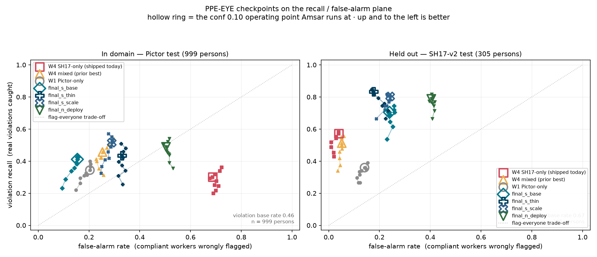
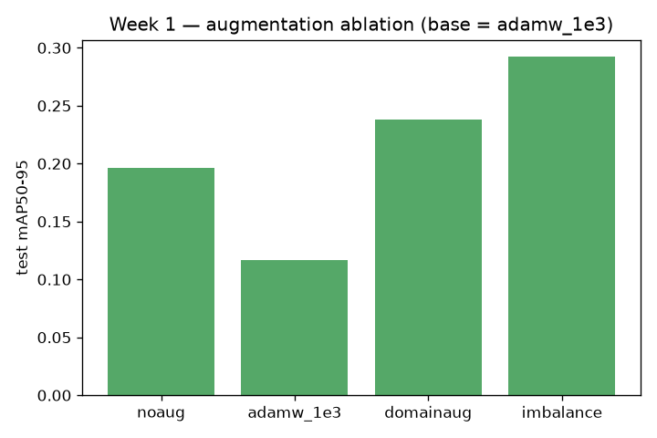
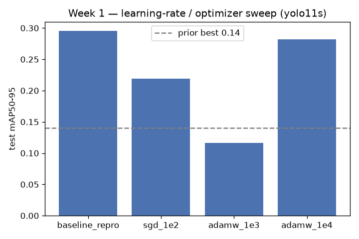
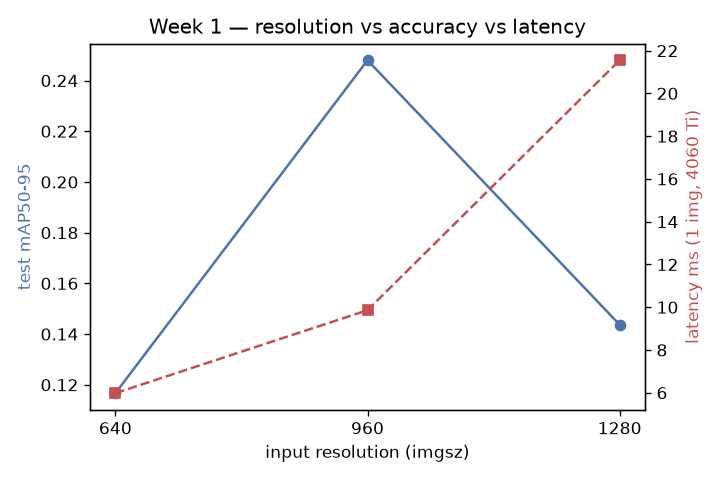
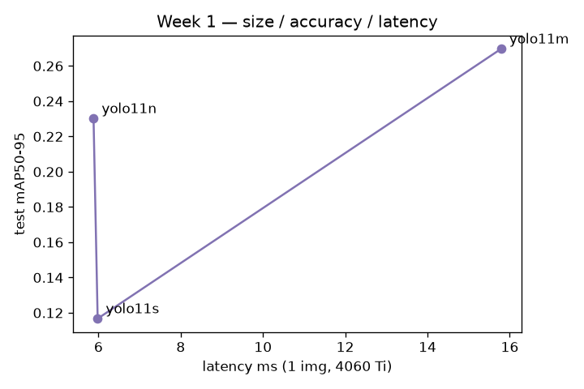
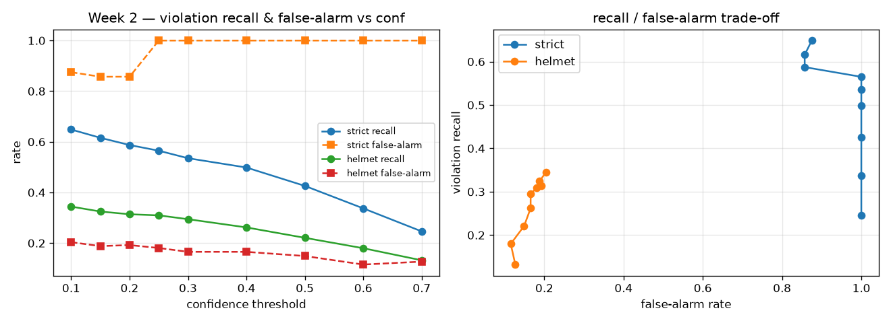
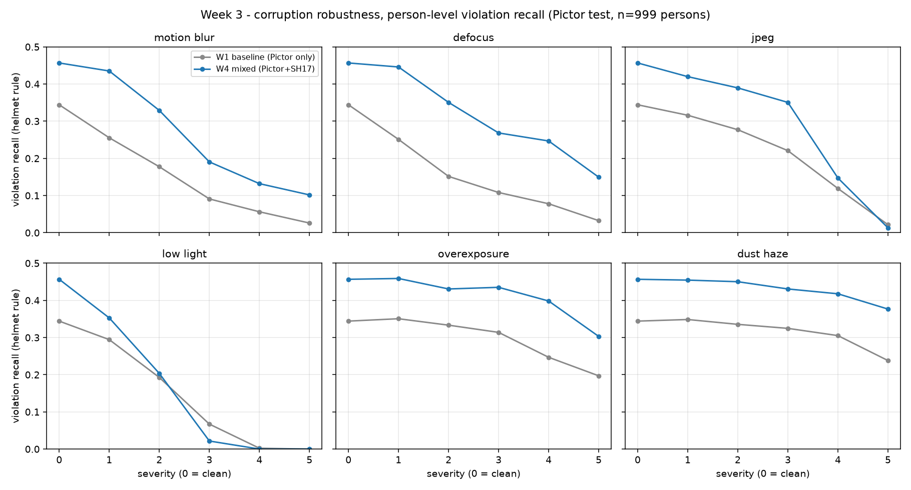
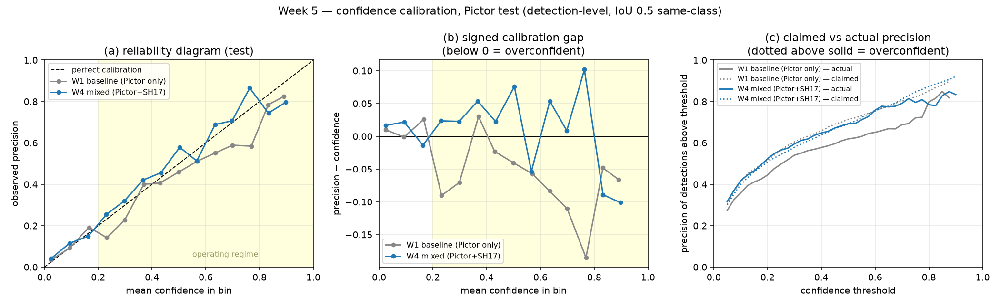

# PPE-EYE enhancement — results

Prior best (lightaug_yolo11s): **mAP50-95 ≈ 0.14**. `Δ` below is vs that.

## Week 1

| id | item | status | test set | mAP50 | mAP50-95 | P | R | lat ms | fps | train min | Δ mAP50-95 | desc |
|---|---|---|---|---|---|---|---|---|---|---|---|---|
| w1_s_baseline_repro | 2 | done | pictor | 0.4941 | 0.2954 | 0.5869 | 0.4748 | 6.7000 | 149.2 | 14.8000 | +0.1554 | Paper's lr0=1e-5 NAdam cell on our split - expected to barely move off COCO init |
| w1_s_sgd_1e2 | 2 | done | pictor | 0.3707 | 0.2189 | 0.3755 | 0.4142 | 6.1500 | 162.7 | 11.8000 | +0.0789 | SGD lr0=1e-2, cosine, warmup 3, close_mosaic 10 |
| w1_s_adamw_1e3 | 2 | done | pictor | 0.2685 | 0.1167 | 0.3174 | 0.3930 | 5.9800 | 167.2 | 15.8000 | -0.0233 | AdamW lr0=1e-3, cosine - the expected LR winner and base recipe for later arms |
| w1_s_adamw_1e4 | 2 | done | pictor | 0.4938 | 0.2822 | 0.5993 | 0.4976 | 6.0800 | 164.5 | 6.8000 | +0.1422 | AdamW lr0=1e-4, cosine |
| w1_s_res_960 | 3 | done | pictor | 0.4614 | 0.2480 | 0.3976 | 0.5086 | 9.8600 | 101.4 | 13.0000 | +0.1080 | Base recipe at imgsz=960 - small-object resolution sweep |
| w1_s_res_1280 | 3 | done | pictor | 0.4242 | 0.1437 | 0.4794 | 0.4538 | 21.5500 | 46.4000 | 28.4000 | +0.0037 | Base recipe at imgsz=1280 - small-object resolution sweep |
| w1_s_noaug | 5 | done | pictor | 0.4038 | 0.1961 | 0.4707 | 0.4602 | 14.4000 | 69.4000 | 7.0000 | +0.0561 | Base recipe, all online augmentation OFF - the control arm for item #5 |
| w1_s_domainaug | 5 | done | pictor | 0.4515 | 0.2382 | 0.5179 | 0.4778 | 13.4200 | 74.5000 | 12.5000 | +0.0982 | Base recipe + strong HSV-V (glare), scale (distance), erasing (occlusion) |
| w1_s_imbalance | * | done | pictor | 0.4528 | 0.2923 | 0.4670 | 0.4816 | 5.9400 | 168.5 | 6.8000 | +0.1523 | Base recipe + copy_paste + mixup to lift thin classes WHV (48) / WV (36) |
| w1_n_adamw_1e3 | 3 | done | pictor | 0.4169 | 0.2302 | 0.4766 | 0.4599 | 5.8800 | 170.0 | 5.7000 | +0.0902 | yolo11n base recipe - deployable size point for the 8-camera budget |
| w1_m_adamw_1e3 | 3 | done | pictor | 0.4610 | 0.2697 | 0.4524 | 0.5193 | 15.7900 | 63.3000 | 17.2000 | +0.1297 | yolo11m base recipe - upper size point, KD teacher candidate |

### Week 1 per-class AP50

| id | W (n=456) | WH (n=517) | WHV (n=20) | WV (n=6) |
|---|---|---|---|---|
| w1_s_baseline_repro | 0.4618 | 0.4443 | 0.0754 | 0.9950 |
| w1_s_sgd_1e2 | 0.2704 | 0.3241 | 0.0646 | 0.8238 |
| w1_s_adamw_1e3 | 0.2709 | 0.3243 | 0.0193 | 0.4597 |
| w1_s_adamw_1e4 | 0.4227 | 0.4275 | 0.1301 | 0.9950 |
| w1_s_res_960 | 0.3801 | 0.4149 | 0.0956 | 0.9550 |
| w1_s_res_1280 | 0.3670 | 0.3700 | 0.1070 | 0.8529 |
| w1_s_noaug | 0.3257 | 0.2978 | 0.0985 | 0.8931 |
| w1_s_domainaug | 0.4499 | 0.4334 | 0.0887 | 0.8339 |
| w1_s_imbalance | 0.3751 | 0.3959 | 0.0451 | 0.9950 |
| w1_n_adamw_1e3 | 0.3727 | 0.3871 | 0.0923 | 0.8157 |
| w1_m_adamw_1e3 | 0.4177 | 0.4427 | 0.0903 | 0.8931 |

## Week 2

| id | item | status | test set | mAP50 | mAP50-95 | P | R | lat ms | fps | train min | Δ mAP50-95 | desc |
|---|---|---|---|---|---|---|---|---|---|---|---|---|
| w2_hard_negatives | 7 | blocked | pictor | - | - | - | - | - | - | - | - | Auto-fetched distractor images as background-only, retrain winner - false-positive mode |

### Week 2 — person-level / audit results

**w2_honest_eval** (honest_person_level)

| rule | conf | violation recall | false-alarm | verdict acc | undetected |
|---|---|---|---|---|---|
| strict | 0.1 | 0.6486 | 0.875 | 0.6444 | 354 |
| helmet | 0.1 | 0.3442 | 0.2036 | 0.5339 | 354 |

**w2_label_audit** (label_audit)

| split | images | objects | obj/img | box area p10/p50/p90 | thin (<30) |
|---|---|---|---|---|---|
| train | 727 | 1059 | 1.46 | 0.00464/0.06478/0.37493 | — |
| val | 154 | 999 | 6.49 | 0.00109/0.00857/0.06722 | WHV, WV |
| test | 316 | 999 | 3.16 | 0.00156/0.01634/0.17018 | WHV, WV |

Flags (1002 on 999 test boxes): edge=277, tiny=163, no_model_support=172, aspect=130, class_disagree=241, unlabeled_pred=19

Auto-clean (tiny AND no_model_support): dropped 88, kept 911 → `labels_clean/`. Review queue: `w2_label_audit_flags.csv`.

**w2_eval_clean_vs_noisy** (clean_vs_noisy)

| rule | recall noisy→clean | false-alarm | verdict acc noisy→clean | Δ recall |
|---|---|---|---|---|
| strict | 0.6486 → 0.7111 | 0.875 | 0.6444 → 0.7059 | +0.0625 |
| helmet | 0.3442 → 0.3622 | 0.2036 | 0.5339 → 0.5498 | +0.018 |

**w2_sahi_upperbound** (sahi_upperbound)

slice 320px / overlap 0.2 · 0.5 min

| rule | recall full → SAHI | undetected full → SAHI | false-alarm SAHI |
|---|---|---|---|
| strict | 0.6486 → 0.5587 | 354 → 437 | 0.7778 |
| helmet | 0.3442 → 0.3203 | 354 → 437 | 0.2671 |

## Week 3

| id | item | status | test set | mAP50 | mAP50-95 | P | R | lat ms | fps | train min | Δ mAP50-95 | desc |
|---|---|---|---|---|---|---|---|---|---|---|---|---|
| w3_corruptions | 8 | done | pictor | - | - | - | - | - | - | - | - | Motion blur / defocus / JPEG / low light / overexposure / dust-haze x 5 severities, scored person-level |
| w3_darkaug | 8 | done | pictor(test) | 0.4318 | 0.2805 | 0.4836 | 0.4702 | 6.0900 | 164.2 | 10.9000 | +0.1405 | Mixed recipe + aggressive brightness aug (hsv_v 0.9 -> value gain 0.1-1.9x) to attack the low-light collapse found by w3_corruptions |
| w3_corrupt_dark | 8 | done | pictor | - | - | - | - | - | - | - | - | Re-run the corruption benchmark on the dark-augmented model - does hsv_v=0.9 recover the low-light collapse? |

### Week 3 per-class AP50

| id | W (n=456) | WH (n=517) | WHV (n=20) | WV (n=6) |
|---|---|---|---|---|
| w3_darkaug | 0.4570 | 0.4358 | 0.0605 | 0.7736 |

## Week 4

| id | item | status | test set | mAP50 | mAP50-95 | P | R | lat ms | fps | train min | Δ mAP50-95 | desc |
|---|---|---|---|---|---|---|---|---|---|---|---|---|
| w4_sh17_train | 9 | done | sh17-v1 | 0.5835 | 0.4257 | 0.6614 | 0.5271 | 6.0200 | 166.1 | 5.8000 | +0.2857 | Train on SH17-compliance ONLY (498 PPE-bearing imgs, mapped to W/WH/WHV/WV), cross-eval on Pictor test |
| w4_mixed_train | 9 | done | pictor(test) | 0.4948 | 0.3019 | 0.6508 | 0.4572 | 6.7200 | 148.7 | 9.9000 | +0.1619 | Train on Pictor + SH17-compliance combined; val/test stay PURE Pictor so the number is comparable to Weeks 1-2 |
| w4_crossdata_sh17 | 9 | done | sh17-v1-ood | 0.1704 | 0.0926 | 0.2684 | 0.2848 | - | - | - | -0.0474 | Week-1 Pictor-only model evaluated on SH17-compliance test - the generalisation drop |
| w4_crossdata_chv | 9 | blocked | pictor | - | - | - | - | - | - | - | - | Cross-dataset test on CHV after ontology mapping |
| w4_track_vote | 10 | pending | pictor | - | - | - | - | - | - | - | - | N-frame confidence-weighted vote over noisy re-observations, N in {1,3,5,7,9} - proxy for Amsar's PPESmoother (no video in repo) |

**w4_crossdata_sh17** (crossdata)

`w1_s_adamw_1e4` on **sh17** (never trained on it) — mAP50 0.1704, mAP50-95 0.0926

| conf (helmet) | violation recall | false-alarm | verdict acc | undetected |
|---|---|---|---|---|
| 0.1 | 0.24 | 0.2334 | 0.5222 | 415 |
| 0.2 | 0.2157 | 0.235 | 0.5037 | 477 |
| 0.3 | 0.2 | 0.2215 | 0.4944 | 541 |
| 0.5 | 0.1652 | 0.2285 | 0.4401 | 724 |

### Week 4 per-class AP50

| id | W (n=456) | WH (n=517) | WHV (n=20) | WV (n=6) |
|---|---|---|---|---|
| w4_sh17_train | 0.5113 | 0.7080 | 0.5819 | 0.5327 |
| w4_mixed_train | 0.4566 | 0.4549 | 0.0728 | 0.9950 |
| w4_crossdata_sh17 | 0.1150 | 0.2584 | 0.2196 | 0.0886 |

## Week 5

| id | item | status | test set | mAP50 | mAP50-95 | P | R | lat ms | fps | train min | Δ mAP50-95 | desc |
|---|---|---|---|---|---|---|---|---|---|---|---|---|
| w5_kd_x_to_s | 11 | pending | pictor(test) | - | - | - | - | - | - | - | - | yolo11m teacher -> yolo11s student via teacher pseudo-labelling on the mixed train set |
| w5_kd_x_to_n | 11 | pending | pictor(test) | - | - | - | - | - | - | - | - | yolo11m teacher -> yolo11n student via teacher pseudo-labelling - the deployable size point |
| w5_calibration | 12 | done | pictor | - | - | - | - | - | - | - | - | Reliability diagrams + temperature scaling; ECE before/after. T fitted on val, reported on test |

## Week 6

| id | item | status | test set | mAP50 | mAP50-95 | P | R | lat ms | fps | train min | Δ mAP50-95 | desc |
|---|---|---|---|---|---|---|---|---|---|---|---|---|
| w6_p2_head | 13 | pending | pictor(test) | - | - | - | - | - | - | - | - | P2/4 detection head for small, distant workers - accuracy gain vs latency cost |
| w6_attention | 14 | running | pictor(test) | - | - | - | - | - | - | - | - | CBAM / ECA / SE / CoordAtt after each neck output - ablation rows only |
| w6_two_stage | 15 | done | pictor | - | - | - | - | - | - | - | - | person detector -> crop -> PPE classifier: latency as a function of worker count, vs the single-pass model |
| w6_baselines | 16 | pending | pictor(test) | - | - | - | - | - | - | - | - | RT-DETR baseline on the same data and recipe (D-FINE / RTMDet are not in ultralytics 8.4) |
| w6_qat | 17 | done | pictor(test) | - | - | - | - | - | - | - | - | Post-training quantisation: FP32 vs TensorRT FP16 vs TensorRT INT8 vs ONNX - accuracy retention and latency |

**w6_two_stage** (arch)

single pass 7.3 ms · person stage 7.31 ms · per-crop classifier 0.241 ms

| workers in frame | single-pass ms | cascade ms | cascade / single |
|---|---|---|---|
| 1 | 7.3 | 7.55 | 1.03x |
| 2 | 7.3 | 7.79 | 1.07x |
| 3 | 7.3 | 8.03 | 1.1x |
| 5 | 7.3 | 8.52 | 1.17x |
| 10 | 7.3 | 9.72 | 1.33x |
| 20 | 7.3 | 12.13 | 1.66x |
| 40 | 7.3 | 16.95 | 2.32x |

_classifier is a 3-conv stub - a deliberate lower bound on the cascade's stage-2 cost. A real PPE classifier is slower, so the crossover reported here is optimistic for the cascade._

**w6_qat** (arch)

| format | mAP50 | mAP50-95 | retention | lat ms | fps | file MB |
|---|---|---|---|---|---|---|
| fp32 | 0.4948 | 0.3019 | 1.0 | 5.91 | 169.1 | 19.18 |
| fp16_trt | — | — | — | — | — | _ModuleNotFoundError: No module named 'tensorrt'_ |
| int8_trt | — | — | — | — | — | _ModuleNotFoundError: No module named 'tensorrt'_ |
| onnx_fp32 | — | — | — | — | — | _RuntimeError: Error when binding input: There's no data transfer regis_ |

## Week 7

| id | item | status | test set | mAP50 | mAP50-95 | P | R | lat ms | fps | train min | Δ mAP50-95 | desc |
|---|---|---|---|---|---|---|---|---|---|---|---|---|
| final_s_base | deploy | done | pictor(test) | 0.2893 | 0.1496 | 0.3435 | 0.3680 | 6.0700 | 164.6 | 10.5000 | +0.0096 | yolo11s on Pictor + SH17-v2 (bare-head negatives), Week-1 winning recipe, no extra augmentation |
| final_s_thin | deploy | done | pictor(test) | 0.2972 | 0.1594 | 0.3948 | 0.3618 | 7.8100 | 128.0 | 9.2000 | +0.0194 | Same, plus copy_paste/mixup - the Week-1 thin-class arm, retested now that WHV has 180 train instances instead of 53 |
| final_n_deploy | deploy | done | pictor(test) | 0.4747 | 0.2494 | 0.5524 | 0.4877 | 5.9500 | 168.1 | 8.0000 | +0.1094 | yolo11n on the same data - the size point Amsar actually deploys (8 cameras, one forward pass) |
| final_s_scale | deploy | done | pictor(test) | 0.4554 | 0.2671 | 0.4644 | 0.5091 | 6.0900 | 164.1 | 10.5000 | +0.1271 | Same data, plus scale/translate jitter only - isolates the distance-matching augmentation that w1_s_domainaug bundled with brightness and erasing |
| final_s_mixval | deploy | done | finest | 0.2893 | 0.1496 | 0.3435 | 0.3680 | 5.9600 | 167.7 | 9.6000 | +0.0096 | Same data and recipe as final_s_base; only the VAL set changes (Pictor val + SH17-v2 val) so early stopping is not driven by Pictor val's 6.49 persons/img outlier distribution |
| final_n_mixval | deploy | done | finest | 0.4747 | 0.2494 | 0.5524 | 0.4877 | 6.0100 | 166.3 | 8.5000 | +0.1094 | yolo11n on the mixed-val config - the deployable size point, selected on a representative val set |

### Week 7 per-class AP50

| id | W (n=456) | WH (n=517) | WHV (n=20) | WV (n=6) |
|---|---|---|---|---|
| final_s_base | 0.4265 | 0.4320 | 0.0359 | 0.2627 |
| final_s_thin | 0.3888 | 0.4081 | 0.0336 | 0.3582 |
| final_n_deploy | 0.4036 | 0.3649 | 0.1354 | 0.9950 |
| final_s_scale | 0.4339 | 0.4610 | 0.0335 | 0.8931 |
| final_s_mixval | 0.4265 | 0.4320 | 0.0359 | 0.2627 |
| final_n_mixval | 0.4036 | 0.3649 | 0.1354 | 0.9950 |

## Figures

